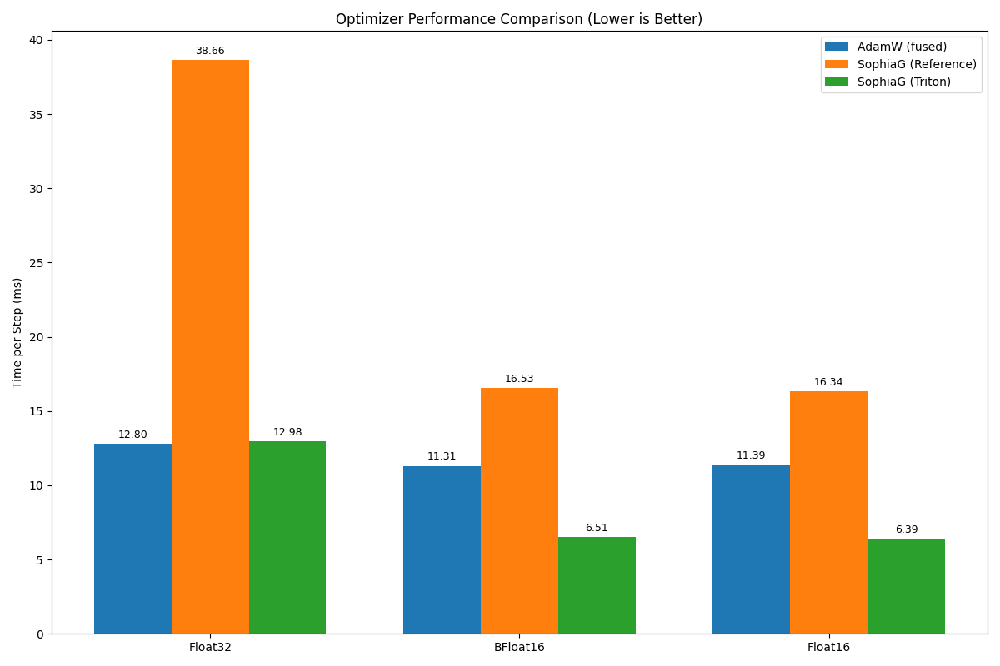

# SophiaG Triton: Unofficial Triton-Optimized Stochastic Second-order Optimizer

This is an unofficial adaptation of the **Sophia-G** optimizer, originally introduced in the paper [https://arxiv.org/abs/2305.14342](https://arxiv.org/abs/2305.14342) by Liu et al., enhanced with Triton's GPU kernel capabilities for superior performance. Unlike the official implementation, this version focuses on leveraging Triton to accelerate computations, offering a distinct approach to the original SophiaG framework. Please star this repo if you find it valuable!

## News and Updates
- Initial release with Triton-optimized SophiaG, benchmarked on August 15, 2025.

## Dependencies
- [PyTorch](https://pytorch.org) >= 2.0.0
- [Triton](https://triton-lang.org) >= 2.0.0

## General Usage

Below is an example code snippet for training a general model with NLL loss using the Triton-optimized SophiaG, inspired by the original SophiaG usage but adapted for this implementation.

```python
import torch
import torch.nn.functional as F
from sophia_triton import SophiaG

# init model loss function and input data
model = Model()
data_loader = ...

# init the optimizer
optimizer = SophiaG(model.parameters(), lr=2e-4, betas=(0.965, 0.99), rho=0.01, weight_decay=1e-1)

total_bs = len(data_loader)
bs = total_bs * block_size
k = 10
iter_num = -1

# training loop
for epoch in range(epochs):
    for X, Y in data_loader:
        # standard training code
        logits, loss = model(X, Y)
        loss.backward()
        optimizer.step(bs=bs)
        optimizer.zero_grad(set_to_none=True)
        iter_num += 1

        if iter_num % k != k - 1:
            continue
        else:
            # update hessian EMA
            logits, _ = model(X, None)
            samp_dist = torch.distributions.Categorical(logits=logits)
            y_sample = samp_dist.sample()
            loss_sampled = F.cross_entropy(logits.view(-1, logits.size(-1)), y_sample.view(-1), ignore_index=-1)
            loss_sampled.backward()
            optimizer.update_hessian()
            optimizer.zero_grad(set_to_none=True)
            model.zero_grad()
```

## Hyper-parameter Tuning

### Definition of Learning Rate
- The update follows the original formulation $\theta_{t+1} = \theta_t - lr*\textup{clip}(m_t / (\rho * h_t + \epsilon), 1)$, as per the paper, where `lr` corresponds to $\rho \cdot \eta_t$. This re-parameterization differs from AdamW or Lion, where a 5:1 learning rate ratio is empirically comparable. The Triton version retains this structure but benefits from larger effective learning rates due to GPU acceleration, consistent with the original SophiaG's design.

### Tuning the Hyperparameter \(\rho\)
- Adjust \(\rho\) to maintain the proportion of clipped coordinates between 0.1 and 0.5, a guideline drawn from the original SophiaG tuning process. Monitor this as a custom metric during training.

### Tuning Learning Rate and Weight Decay
- Set `lr` slightly below AdamW's typical value or 3-5 times Lion's, as recommended in the original paper. If loss instability occurs, reduce `lr` or increase \(\rho\).
- Use approximately 2x the weight decay compared to AdamW, aligning with the original SophiaG suggestions.

## Benchmark Results

The Triton-optimized SophiaG was benchmarked against the original Python reference implementation (available at [https://github.com/Liuhong99/Sophia/blob/main/sophia.py](https://github.com/Liuhong99/Sophia/blob/main/sophia.py)) and fused AdamW across various precisions. The results showcase notable performance enhancements:

<p align="center" width="100%">
    
</p>

### Performance Comparison
- **Float32**: Triton SophiaG (12.98 ms/step) achieves ~3x speedup over the original SophiaG (38.66 ms/step) and matches AdamW (12.80 ms/step).
- **BFloat16**: Triton SophiaG (6.51 ms/step) offers ~2.5x improvement over the original (16.53 ms/step) and ~1.7x over AdamW (11.31 ms/step).
- **Float16**: Triton SophiaG (6.39 ms/step) provides ~2.6x speedup over the original (16.34 ms/step) and ~1.7x over AdamW (11.39 ms/step).

These gains reflect the Triton optimization's effectiveness, building on the original SophiaG's second-order optimization principles.

## Acknowledgement

This project draws inspiration from the original SophiaG optimizer by Liu et al., with significant enhancements via Triton's GPU acceleration. Special thanks to the original authors for their foundational work, detailed in [https://github.com/Liuhong99/Sophia](https://github.com/Liuhong99/Sophia). The Triton integration is a community-driven effort to extend the original implementation's capabilities.
